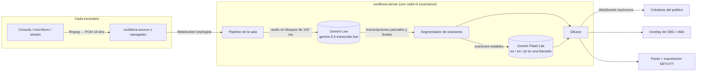

# Vox Libera

[English](README.md) · **Español**

**Subtítulos y traducción en vivo, open source, para conferencias con varios escenarios.**
Conecta el audio de cada escenario y el público recibe subtítulos en tiempo real en el idioma
original y en español, inglés y portugués, en su celular o sobreimpresos en el stream.

Creado para [Nerdearla](https://nerdear.la) 2026 y pensado para que cualquier conferencia lo pueda
desplegar. Funciona con la Gemini Live API. Licencia Apache 2.0.

| Para el público | Para producción |
|---|---|
| Elegir escenario e idioma y leer los subtítulos en vivo desde cualquier celular | Un panel para todos los escenarios: estado, latencia, errores, costo |
| Descargar la transcripción completa (SRT / VTT / TXT) al terminar la charla | URL de overlay para OBS / vMix con fondo transparente, sin chroma key |
| Funciona con charlas en español e inglés, incluso si se mezclan los idiomas | Glosario por escenario para nombres de oradores y términos técnicos |

---

## Inicio rápido (5 minutos)

Necesitas **Python 3.11+**, **ffmpeg** en el PATH y una **API key de Gemini** ([se obtiene en AI Studio](https://aistudio.google.com/apikey)).

```bash
git clone https://github.com/Kitatzu/voxlibera.git
cd voxlibera
python -m venv .venv
# Windows: .venv\Scripts\activate    macOS/Linux: source .venv/bin/activate
pip install -e .

echo GEMINI_API_KEY=tu-key > .env   # ignorado por git; también sirven variables de entorno
voxlibera-server
```

> **Windows PowerShell:** crea el archivo con `Set-Content .env "GEMINI_API_KEY=tu-key" -Encoding ascii`
> (`echo >` lo guarda en UTF-16 y Docker Compose no lo puede leer).

Después abre:

| URL | Qué es |
|---|---|
| http://localhost:8000/dashboard.html | Panel de producción. Presiona **▶ Reproducir ejemplo** en dos escenarios para reproducir las charlas de ejemplo incluidas. |
| http://localhost:8000/ | Vista del público: elegir escenario e idioma. |
| http://localhost:8000/broadcast.html | Enviar audio desde el navegador: micrófono, una pestaña (por ejemplo, una charla de YouTube) o un archivo. |
| http://localhost:8000/obs.html?room=main-stage&lang=es | Overlay para OBS (agrégalo como *Fuente de navegador*). |

Listo: dos escenarios transcribiendo y traduciendo en paralelo con los ejemplos incluidos.
La interfaz está en inglés y en español (selector EN | ES en la barra superior).

### O con Docker

```bash
echo GEMINI_API_KEY=tu-key > .env
docker compose up --build        # PORT=8080 docker compose up para usar otro puerto
```

---

## Enviar audio real

Cada escenario (sala) acepta **una fuente de audio**. Las salas se definen en [`rooms.yaml`](rooms.yaml).

**Lo más fácil: el navegador.** Abre `/broadcast.html` en la computadora del escenario, elige el
escenario, presiona 🎙 **Micrófono** (o 🖥 **Audio de pestaña o pantalla**, 📁 **Archivo de audio**) y **Transmitir**.
Los subtítulos aparecen en la misma pantalla.

**Para instalaciones sin operador, la CLI** (cualquier cosa que ffmpeg pueda leer):

| Fuente | Comando |
|---|---|
| Archivo de audio o video (a velocidad real) | `voxlibera-source --room main-stage --file samples/talk-en.opus` |
| Micrófono / placa de audio | `voxlibera-source --room main-stage --mic "Microphone (USB Audio)"` |
| Stream en vivo (RTMP, SRT, HLS, Icecast...) | `voxlibera-source --room main-stage --url rtmp://mixer.local/live/stage1` |
| Video o transmisión en vivo de YouTube | `voxlibera-source --room main-stage --youtube <url>` (agrega `--live` para transmisiones en vivo, requiere `yt-dlp`) |
| Listar micrófonos | `voxlibera-source --list-devices` |

La fuente puede correr en la misma máquina que el servidor o en una notebook junto a la consola del
escenario (`--server wss://subtitulos.ejemplo.org`). Si el servidor define `VOXLIBERA_ADMIN_KEY`, pásala con `--token`.

---

## Cómo funciona



### Decisiones de diseño (y los experimentos detrás)

Medimos la Live API con charlas reales de Nerdearla antes de escribir el pipeline.

| Hallazgo | Decisión |
|---|---|
| Las transcripciones parciales llegan cada ~0,5 s, a menos de 1 s del orador, con excelente precisión en nombres (*Ilya Repin*, *100Devs*). | Transcripción en streaming en lugar de enviar bloques de 3–5 s: menos latencia y sin palabras cortadas en los bordes. |
| Gemini solo **finaliza** una frase cuando el orador hace una pausa. Oradores fluidos pasaron **más de 50 s** sin un final. | Traducir cada oración apenas está completa y estable en el texto parcial (~1 s), sin esperar el final. Los finales se usan para corregir oraciones ya mostradas. |
| Ajustar la detección de voz (`END_SENSITIVITY_HIGH`, 300 ms de silencio) bajó las frases de ~50 s a 3–10 s. | Activado, pero la estrategia de oraciones estables sigue cubriendo a oradores que no pausan. |
| Una sesión Live dura ~590 s. El servidor envía `GoAway` 50 s antes del final y **corta con error 1008** si el cliente no cierra. | Rotación sin cortes: con el `GoAway` se abre una segunda sesión, se envía audio a ambas, se hace el traspaso en el siguiente final de la sesión vieja y se eliminan las palabras repetidas. Funciona con charlas de cualquier duración. |
| El modo de transcripción `SMART` convertía oraciones en listas Markdown y omitía contenido. | Transcripción `VERBATIM`; las muletillas las elimina el prompt de traducción, que tiene prohibido resumir. |
| Una sola llamada de traducción con todos los idiomas, con glosario y oración anterior como contexto, corrigió errores de reconocimiento ("your eyes" → "URIs"). | Un request a Flash-Lite por oración para todos los idiomas. Agregar un idioma no suma requests. |

---

## Escalar a muchos escenarios

**Un solo proceso del servidor maneja muchos escenarios.** Todo es asíncrono y el trabajo pesado lo hace Gemini.

| Límite | Valor | Notas |
|---|---|---|
| Sesiones Live simultáneas por API key | 20 probadas sin errores | Durante la rotación un escenario usa 2 sesiones por unos segundos. |
| Tokens de transcripción por minuto | 100K TPM (tier 1) | ~2K tokens/min por stream → **~25 escenarios por key**. |
| Requests de traducción por día | 150K RPD | ~8–10 oraciones/min por escenario → 10 escenarios × 8 h ≈ 48K requests. |
| Latencia de traducción | ~1 s | Medido: el subtítulo traducido aparece ~0,6 s después de que termina la oración. |

### Crecer paso a paso

Elige la configuración más chica que cubra tu evento; cada paso mantiene el mismo código y las mismas URLs.

| Tamaño del evento | Configuración | Qué cambia |
|---|---|---|
| **1–3 escenarios**, un meetup | `voxlibera-server` en una notebook, el público en el Wi-Fi del lugar | Nada. Se transmite desde el navegador. |
| **Hasta ~25 escenarios** | Un servidor (VM o `docker compose`) detrás de HTTPS, una API key | Definir `VOXLIBERA_ADMIN_KEY`. Una fuente de audio por escenario (navegador o CLI). |
| **Más de ~25 escenarios** | **Repartir escenarios entre instancias.** Cada instancia tiene su parte de `rooms.yaml` y su API key. Un proxy reverso enruta por id de sala. | Solo configuración (ver abajo). Sin cambios de código. |
| **Miles de espectadores por escenario** | Varias réplicas de una instancia detrás de un balanceador; reemplazar el difusor en memoria por **Redis Pub/Sub**. | ~40 líneas: la interfaz del [`Broadcaster`](voxlibera/broadcaster.py) son 3 métodos (`publish`, `subscribe`, `unsubscribe`). |
| **Varios eventos / ciudades** | Un despliegue por evento, o por región para tener el audio cerca del endpoint de Gemini. | Solo despliegue. |

**Ejemplo de reparto** (nginx): todas las URLs llevan el id de la sala (`/ws/ingest/<sala>`,
`/ws/rooms/<sala>`, `/api/rooms/<sala>/...`), así que enrutar es una tabla de búsqueda.

```nginx
map $uri $voxlibera_backend {
    ~/(main-stage|stage-b|stage-c)(/|$)   instance_a:8000;   # rooms-a.yaml, key A
    ~/(stage-d|stage-e|workshop-1)(/|$)   instance_b:8000;   # rooms-b.yaml, key B
    default                               instance_a:8000;
}
```

**Por qué escala así:**

- **La transcripción y la traducción corren en Gemini.** El servidor solo mueve audio y texto, así que una VM chica maneja muchos escenarios. El límite real es la cuota de la API por key; por eso se reparten los escenarios por key.
- **Cada escenario es independiente.** Una sesión de Gemini y un pipeline por escenario, sin estado compartido entre escenarios. Si uno falla, no afecta a los demás, y agregar un escenario es una línea en `rooms.yaml`.
- **Las fuentes de audio son procesos independientes** (una pestaña del navegador o la CLI), una por escenario, en cualquier lugar de la red.
- **El tráfico del público es mínimo.** Unos pocos mensajes JSON cortos por segundo por escenario, distribuidos por WebSockets. El frontend estático se puede servir desde un CDN.

> Todavía sin pruebas de carga: la capacidad de espectadores por instancia es una estimación. Antes
> de un evento grande, conviene correr una prueba de carga de WebSockets (por ejemplo, con k6) contra
> `/ws/rooms/<sala>` con el tamaño de público esperado.

### Costo

Medido en una charla de 12 minutos: **US$ 0,16 → unos US$ 0,80 por hora por escenario**, con tres
idiomas de destino (≈ US$ 0,55/h de transcripción a US$ 0,009/min, el resto es traducción). El panel
muestra una estimación en vivo por escenario; los precios se configuran en [`config.py`](voxlibera/config.py).
Revisa los [precios actuales de Gemini](https://ai.google.dev/gemini-api/docs/pricing).

### Medido con una charla real de 12 minutos

| Métrica | Valor |
|---|---|
| Rotaciones de sesión (GoAway) / errores | 1 / 0, sin palabras perdidas ni duplicadas en el traspaso |
| Oraciones | 159 |
| Latencia de traducción | ~1 s |
| Demora del subtítulo traducido tras el fin de la oración | ~0,6 s |

---

## Configuración

### `rooms.yaml`

```yaml
glossary: [Nerdearla, Kubernetes, deploy]      # compartido por todos los escenarios

rooms:
  - id: main-stage                             # se usa en las URLs
    name: Main Stage
    description: Keynotes and main track       # se envía como contexto al traductor
    glossary: [Ilya Repin, Kuokkala]           # nombres de oradores, jerga de la charla
```

El glosario se usa dos veces: como **vocabulario personalizado** para el reconocimiento de voz
(ortografía de nombres) y en el **prompt de traducción**, donde los términos no se traducen.
Conviene mantenerlo por debajo de ~100 términos por escenario. Tip: actualiza el glosario de cada
escenario con el nombre del próximo orador y las palabras clave de su charla.

### Variables de entorno

| Variable | Por defecto | Descripción |
|---|---|---|
| `GEMINI_API_KEY` | — | **Obligatoria.** API key de Gemini. |
| `VOXLIBERA_TARGET_LANGUAGES` | `es,en,pt` | Idiomas de traducción (códigos BCP-47). |
| `VOXLIBERA_TRANSCRIBE_MODEL` | `gemini-3.5-transcribe-live` | Modelo de transcripción en vivo. |
| `VOXLIBERA_TRANSLATE_MODEL` | `gemini-3.5-flash-lite` | Modelo de traducción. |
| `VOXLIBERA_ROOMS_FILE` | `rooms.yaml` | Escenarios que sirve esta instancia. |
| `VOXLIBERA_ADMIN_KEY` | — | **Defínela en cualquier despliegue público.** Se necesita para transmitir audio y para las acciones del panel (las páginas la piden una vez). El público nunca la necesita. |
| `VOXLIBERA_DATA_DIR` | `data/` | Dónde se guardan las transcripciones (JSONL por escenario). |
| `VOXLIBERA_PORT` / `VOXLIBERA_HOST` | `8000` / `0.0.0.0` | Dirección del servidor. |

---

## Salidas

| Salida | Cómo |
|---|---|
| App web para el público | `/` → links para compartir como `/?room=main-stage&lang=es` (imprímelos como código QR en cada escenario). |
| Overlay para OBS / vMix | `/obs.html?room=main-stage&lang=en&lines=2&size=42&position=bottom`, fondo transparente. |
| Archivos de transcripción | `/api/rooms/<sala>/export?format=srt\|vtt\|txt&lang=original\|es\|en\|pt`, o los botones de la interfaz. Para limpiar un escenario entre charlas: botón **Borrar transcripción** del panel. |
| Integraciones | API WebSocket + REST documentada en [`docs/PROTOCOL.md`](docs/PROTOCOL.md). |

---

## Desarrollo

```bash
pip install -e ".[dev]"
pytest
```

| Ruta | Qué es |
|---|---|
| [`voxlibera/live_transcriber.py`](voxlibera/live_transcriber.py) | Sesiones Gemini Live, rotación por GoAway, reconexión. |
| [`voxlibera/segmenter.py`](voxlibera/segmenter.py) | Transcripciones parciales → oraciones estables + correcciones. |
| [`voxlibera/translator.py`](voxlibera/translator.py) | Traducción a varios idiomas en una llamada, con glosario. |
| [`voxlibera/room.py`](voxlibera/room.py) | Pipeline por escenario, métricas, persistencia. |
| [`voxlibera/server.py`](voxlibera/server.py) | API REST + WebSocket con FastAPI, frontend estático. |
| [`voxlibera/source.py`](voxlibera/source.py) | CLI de fuente de audio (archivo, micrófono, stream, YouTube). |
| [`web/`](web/) | Vista del público, página de transmisión, overlay de OBS, panel. HTML/JS sin build, funciona offline. Textos de la interfaz en [`web/i18n.js`](web/i18n.js). |

## Mejoras futuras

Ideas para las próximas iteraciones, más o menos por impacto.

**Para el público**
- [ ] **Audio traducido para auriculares**: `gemini-3.5-live-translate` ya genera voz; ofrecerlo como canal de audio por idioma.
- [ ] **Opciones de accesibilidad**: tema de alto contraste, tipografía para dislexia, interlineado, búsqueda en el historial de subtítulos.
- [ ] **Códigos QR** por escenario e idioma, generados desde el panel, listos para imprimir.

**Para producción**
- [ ] **Editar el glosario desde el panel** sin reiniciar, y **cargarlo desde la agenda del evento**: los nombres de oradores y las palabras clave cambian solos cuando empieza cada charla.
- [ ] **Una transcripción por charla**: separar y exportar los archivos automáticamente según la agenda.
- [ ] **Persona en el circuito**: un voluntario corrige en vivo una palabra mal reconocida y la corrección se suma al glosario.
- [ ] **Exportar métricas** (Prometheus / OpenTelemetry) y alertas cuando un escenario queda en silencio o falla repetidamente.

**Para escala e independencia**
- [ ] **Difusor con Redis Pub/Sub**, incluido y probado, para despliegues con varias réplicas.
- [ ] **Modo 100% local** con Gemma o Whisper, para eventos sin presupuesto o sin internet. El transcriptor y el traductor son módulos aislados para facilitar ese cambio.
- [ ] **Pruebas de carga** en CI, más plantillas de despliegue en un clic (Cloud Run, Fly.io, Render).
- [ ] **Más idiomas de entrada** (charlas en portugués, por ejemplo): el modelo ya detecta el idioma automáticamente; falta probarlo y ajustarlo.

**Para la calidad**
- [ ] **Volver a traducir la transcripción final** al exportar, para que los SRT usen el texto más preciso.
- [ ] **Identificar oradores**, cuando la Live API soporte diarización.

## Limitaciones conocidas

- La Live API no ofrece diarización de oradores ni timestamps por palabra; el timing de los subtítulos es por oración.
- La traducción en vivo de una oración puede diferir un poco de la transcripción final; la versión corregida la reemplaza en pantalla y en las exportaciones.
- Todavía no hay un modo 100% local (Gemma); el transcriptor y el traductor son módulos aislados para facilitar ese cambio.

## Licencia

[Apache License 2.0](LICENSE). El audio de ejemplo en [`samples/`](samples/) proviene de charlas públicas de Nerdearla, ver [`samples/README.md`](samples/README.md).
