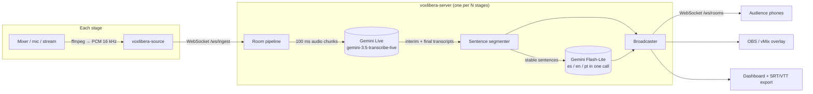

# Vox Libera

**English** · [Español](README.es.md)

**Open source live captions and translation for multi-stage conferences.**
Plug in the audio of every stage and the audience gets real-time subtitles in the original
language plus Spanish, English and Portuguese, on their phone or burned into the stream.

Built for [Nerdearla](https://nerdear.la) 2026, designed so any conference can deploy it.
Powered by the Gemini Live API. Licensed under Apache 2.0.

> **Load-tested:** 10 stages transcribing in parallel + 200 viewers, **0 errors**, ~1 s translation
> latency, ~150 MB RAM and ~8% of one CPU core on the server, **≈ US$ 0.77 per stage-hour**.

| For the audience | For production |
|---|---|
| Pick a stage and a language, read live captions on any phone | One dashboard for every stage: status, latency, errors, cost |
| Download the full transcript (SRT / VTT / TXT) after the talk | OBS / vMix overlay URL, transparent background, no chroma key |
| Works for Spanish and English talks, with or without code-switching | Per-stage glossary for speaker names and tech jargon |

---

## At a glance: quality, latency, scale, operations, innovation

| | What we did | Evidence (measured with real Nerdearla talks) |
|---|---|---|
| **Quality** | Streaming transcription with a per-stage **glossary used twice** (speech recognition + translation). The translator sees the previous sentence and fixes misrecognitions. Filler words removed, content never summarized. | Proper names right: *Ilya Repin*, *100Devs*, *Kuokkala*. "your eyes" → **"URIs"**. Seamless across session rotations: no lost or duplicated words. |
| **Latency** | No 3–5 s audio chunks: live interim text, and each sentence is translated as soon as it is complete, without waiting for the speaker to pause. | Original text on screen **< 1 s** after it is spoken. Translation request **~1 s**. Translated sentence shown **~1 s after it ends in English talks**, ~4 s in fast-paced Spanish (see *Known limitations*). |
| **Scalability** | One Gemini session per stage, no shared state between stages; one request per sentence returns every language; stages shard across instances by id. | **10 stages + 200 viewers in parallel: 0 errors, 91,400 messages delivered in 3 min, ~150 MB RAM, ~8% of one core.** 20 concurrent Live sessions per key tested. **≈ US$ 0.77 per stage-hour.** |
| **Deployment & operations** | `docker compose up`, one `.env` file. Broadcast from any browser, no install. Dashboard with a button for every action, live status, "last heard" sentence and cost. Admin key. EN/ES UI. | [Event-day runbook](#event-day-runbook). Docker image tested end to end. |
| **Innovation** | Stable-sentence streaming, seamless session rotation, one-call multi-language translation, OBS overlay with transparent background, live cost per stage, per-viewer "clear screen". | The demo video's English subtitles were generated live by Vox Libera itself. |

---

## Quick start (5 minutes)

You need **Python 3.11+**, **ffmpeg** in your PATH and a **Gemini API key** ([get one in AI Studio](https://aistudio.google.com/apikey)).

```bash
git clone https://github.com/Kitatzu/voxlibera.git
cd voxlibera
python -m venv .venv
# Windows: .venv\Scripts\activate    macOS/Linux: source .venv/bin/activate
pip install -e .

echo GEMINI_API_KEY=your-key > .env   # git-ignored; environment variables work too
voxlibera-server
```

> **Windows PowerShell:** create the file with `Set-Content .env "GEMINI_API_KEY=your-key" -Encoding ascii`
> (`echo >` writes UTF-16, which Docker Compose can't read).

Then open:

| URL | What |
|---|---|
| http://localhost:8000/dashboard.html | Production dashboard. Press **▶ Play sample** on two stages to play the bundled sample talks. |
| http://localhost:8000/ | Audience view: choose stage + language. |
| http://localhost:8000/broadcast.html | Send audio from the browser: microphone, a tab (e.g. a YouTube talk) or a file. |
| http://localhost:8000/obs.html?room=main-stage&lang=es | Overlay for OBS (add as *Browser Source*). |

That's it: two stages transcribing and translating in parallel from the included samples.
The UI is available in English and Spanish (EN | ES switch in the top bar).

### Or with Docker

```bash
echo GEMINI_API_KEY=your-key > .env
docker compose up --build        # PORT=8080 docker compose up to use another port
```

---

## Feeding real audio

Each stage (room) accepts **one audio source**. Rooms are defined in [`rooms.yaml`](rooms.yaml).

**Easiest: the browser.** Open `/broadcast.html` on the stage laptop, pick the stage, press
🎙 **Microphone** (or 🖥 **Tab audio**, 📁 **File**) and **Start broadcasting**. Captions show up on the same screen.

**For unattended setups, the CLI** (anything ffmpeg can read):

| Source | Command |
|---|---|
| Audio/video file (played at real-time speed) | `voxlibera-source --room main-stage --file samples/talk-en.opus` |
| Microphone / audio interface | `voxlibera-source --room main-stage --mic "Microphone (USB Audio)"` |
| Live stream (RTMP, SRT, HLS, Icecast...) | `voxlibera-source --room main-stage --url rtmp://mixer.local/live/stage1` |
| YouTube video or live stream | `voxlibera-source --room main-stage --youtube <url>` (add `--live` for live streams, needs `yt-dlp`) |
| List microphones | `voxlibera-source --list-devices` |

The source can run on the same machine as the server or on a laptop next to the stage mixer
(`--server wss://captions.example.org`). If the server sets `VOXLIBERA_ADMIN_KEY`, pass it with `--token`.

---

## Event-day runbook

A checklist for the production team. No command line needed once the server is up.

**The day before**
- [ ] Deploy with Docker behind HTTPS. Set `GEMINI_API_KEY` and `VOXLIBERA_ADMIN_KEY` in `.env`.
- [ ] One room per stage in `rooms.yaml`, with the speakers' names and key terms in each `glossary`.
- [ ] Open the **Dashboard** and press **▶ Play sample** on every stage: all cards should turn *Live* and show a "Last heard" sentence.
- [ ] Print a QR code per stage pointing to `/?room=<stage>&lang=es` (and one per language if you like).
- [ ] Add the overlay to each stream in OBS/vMix: `/obs.html?room=<stage>&lang=es`.

**At each stage (5 minutes)**
- [ ] Connect a laptop to the mixer output (USB audio interface or line in).
- [ ] Open `/broadcast.html` → pick the stage → 🎙 **Microphone** → choose the interface → **Start broadcasting**.
- [ ] Check the level meter moves and captions appear in the preview. Leave that tab open: it shows **● On air**.

**During the talks: watch the Dashboard**
| You see | Meaning | Action |
|---|---|---|
| *Live*, "Last heard" matches the speaker | All good | Nothing |
| *Rotating* for a few seconds | Normal, every ~9 min | Nothing |
| "No audio detected" on the stage laptop | Mixer or cable issue | Check the mixer output level |
| Errors growing, status *Error* | Network or API problem | The server reconnects on its own; if it persists, **Stop** and broadcast again |

**Between talks**
- [ ] **⬇ Download** the transcript (SRT / VTT / TXT, any language), then **🗑 Clear transcript** for the next talk.

---

## How it works



### Design decisions (and the experiments behind them)

We measured the Live API with real Nerdearla talks before writing the pipeline.

| Finding | Decision |
|---|---|
| Interim transcripts arrive every ~0.5 s, < 1 s behind the speaker, with excellent accuracy on names (*Ilya Repin*, *100Devs*). | Streaming transcription instead of sending 3–5 s chunks: lower latency, no words cut at chunk borders. |
| Gemini only **finalizes** an utterance when the speaker pauses. Fluent speakers went **50+ s** without a final. | Translate each sentence as soon as it is complete and stable in the interim text (~1 s), don't wait for finals. Finals are used to correct already-shown sentences. |
| Tuning voice activity detection (`END_SENSITIVITY_HIGH`, 300 ms silence) cut utterances from ~50 s to 3–10 s. | Enabled, but the stable-sentence strategy still covers speakers who never pause. |
| A Live session lasts ~590 s. The server sends `GoAway` 50 s before the end and **aborts with 1008** if the client doesn't close. | Seamless rotation: on `GoAway` open a second session, feed audio to both, hand over at the old session's next final and strip the duplicated words. Talks of any length work. |
| `SMART` transcription mode turned sentences into Markdown bullet lists and dropped content. | `VERBATIM` transcription; filler words are removed by the translation prompt, which is told never to summarize. |
| One translation call returning every language, with glossary + previous sentence as context, fixed recognition errors ("your eyes" → "URIs"). | One Flash-Lite request per sentence for all languages. Adding a language costs no extra requests. |

---

## Scaling to many stages

**One server process handles many stages.** Everything is async and I/O-bound: the heavy lifting runs in Gemini.

| Limit | Value | Notes |
|---|---|---|
| Stages transcribing in parallel on one instance | **10 tested: 0 errors**, with 200 viewers connected | ~150 MB RAM, ~8% of one CPU core. |
| Concurrent Live sessions per API key | 20 tested without errors | Rotation briefly uses 2 sessions per stage. |
| Transcription tokens per minute | 100K TPM (tier 1) | ~2K tokens/min per stream → **~25 stages per key**. |
| Translation requests per day | 150K RPD | ~8–10 sentences/min per stage → 10 stages × 8 h ≈ 48K requests. |
| Translation latency | ~1 s | Measured: the translated caption appears ~0.6 s after the sentence ends. |

### Growing step by step

Pick the smallest setup that covers your event; every step keeps the same code and URLs.

| Event size | Setup | What changes |
|---|---|---|
| **1–3 stages**, a meetup | `voxlibera-server` on a laptop, audience on the venue Wi-Fi | Nothing. Broadcast from the browser. |
| **Up to ~25 stages** | One server (VM or `docker compose`) behind HTTPS, one API key | Set `VOXLIBERA_ADMIN_KEY`. One audio source per stage (browser or CLI). |
| **More than ~25 stages** | **Shard stages across instances.** Each instance gets its own `rooms.yaml` subset and API key. A reverse proxy routes by room id. | Only config (see below). No code changes. |
| **Thousands of viewers per stage** | Several replicas of one instance behind a load balancer; swap the in-memory broadcaster for **Redis Pub/Sub**. | ~40 lines: the [`Broadcaster`](voxlibera/broadcaster.py) interface is 3 methods (`publish`, `subscribe`, `unsubscribe`). |
| **Several events / cities** | One deployment per event, or per region to keep audio close to the Gemini endpoint. | Only deployment. |

**Sharding example** (nginx): every URL carries the room id (`/ws/ingest/<room>`, `/ws/rooms/<room>`,
`/api/rooms/<room>/...`), so routing is a lookup table.

```nginx
map $uri $voxlibera_backend {
    ~/(main-stage|stage-b|stage-c)(/|$)   instance_a:8000;   # rooms-a.yaml, key A
    ~/(stage-d|stage-e|workshop-1)(/|$)   instance_b:8000;   # rooms-b.yaml, key B
    default                               instance_a:8000;
}
```

**Why it scales this way:**

- **Transcription and translation run in Gemini.** The server only moves audio and text, so a small VM handles many stages. The real limit is the API quota per key, which is why stages are sharded by key.
- **Each stage is independent.** One Gemini session and one pipeline per stage, with no shared state between stages. A failing stage never affects the others, and adding a stage is one line in `rooms.yaml`.
- **Audio sources are independent processes** (a browser tab or the CLI), one per stage, anywhere on the network.
- **Audience traffic is tiny.** A few short JSON messages per second per stage, fanned out over WebSockets. The static frontend can be served from a CDN.

> **Load test** (one instance, Windows laptop): 10 stages playing real talks + 200 WebSocket viewers
> (20 per stage) for 3 minutes → 0 transcription errors, 0 viewer errors, 91,400 caption messages
> delivered, translation latency ~1 s, US$ 0.39 total. Viewer capacity beyond that is an estimate:
> before a big event, run a WebSocket load test against `/ws/rooms/<room>` with the expected audience.

### Cost

Measured on a 12-minute talk: **US$ 0.16 → about US$ 0.80 per hour per stage**, with three target
languages (≈ US$ 0.55/h transcription at US$ 0.009/min, the rest translation). The dashboard shows a
live estimate per stage; prices are configurable in [`config.py`](voxlibera/config.py). Check the
current [Gemini pricing](https://ai.google.dev/gemini-api/docs/pricing).

### Measured on a real 12-minute talk

| Metric | Value |
|---|---|
| Session rotations (GoAway) / errors | 1 / 0, no lost or duplicated words at the handoff |
| Sentences | 159 |
| Translation latency | ~1 s |
| Translated caption delay after the sentence ends | ~0.6 s |

---

## Configuration

### `rooms.yaml`

```yaml
glossary: [Nerdearla, Kubernetes, deploy]      # shared by every stage

rooms:
  - id: main-stage                             # used in URLs
    name: Main Stage
    description: Keynotes and main track       # sent as context to the translator
    glossary: [Ilya Repin, Kuokkala]           # speaker names, talk-specific jargon
```

The glossary is used twice: as **custom vocabulary** for speech recognition (spelling of names) and
in the **translation prompt**, where terms are kept untranslated. Keep it under ~100 terms per stage.
Tip: update each stage's glossary with the next speaker's name and talk keywords.

### Environment variables

| Variable | Default | Description |
|---|---|---|
| `GEMINI_API_KEY` | — | **Required.** Gemini API key. |
| `VOXLIBERA_TARGET_LANGUAGES` | `es,en,pt` | Translation targets (BCP-47 codes). |
| `VOXLIBERA_TRANSCRIBE_MODEL` | `gemini-3.5-transcribe-live` | Live transcription model. |
| `VOXLIBERA_TRANSLATE_MODEL` | `gemini-3.5-flash-lite` | Translation model. |
| `VOXLIBERA_ROOMS_FILE` | `rooms.yaml` | Stages served by this instance. |
| `VOXLIBERA_ADMIN_KEY` | — | **Set it on any public deployment.** Required to broadcast audio and to use the dashboard actions (the pages ask for it once). The audience never needs it. |
| `VOXLIBERA_DATA_DIR` | `data/` | Where transcripts are persisted (JSONL per stage). |
| `VOXLIBERA_PORT` / `VOXLIBERA_HOST` | `8000` / `0.0.0.0` | Server bind address. |

---

## Outputs

| Output | How |
|---|---|
| Audience web app | `/` → shareable links like `/?room=main-stage&lang=es` (print them as QR codes at each stage). |
| OBS / vMix overlay | `/obs.html?room=main-stage&lang=en&lines=2&size=42&position=bottom`, transparent background. |
| Transcript files | `/api/rooms/<room>/export?format=srt\|vtt\|txt&lang=original\|es\|en\|pt`, or the buttons in the UI. Reset a stage between talks from the API: `POST /api/rooms/<room>/reset`. |
| Integrations | WebSocket + REST API documented in [`docs/PROTOCOL.md`](docs/PROTOCOL.md). |

---

## Development

```bash
pip install -e ".[dev]"
pytest
```

| Path | What |
|---|---|
| [`voxlibera/live_transcriber.py`](voxlibera/live_transcriber.py) | Gemini Live sessions, GoAway rotation, reconnection. |
| [`voxlibera/segmenter.py`](voxlibera/segmenter.py) | Interim transcripts → stable sentences + corrections. |
| [`voxlibera/translator.py`](voxlibera/translator.py) | One-call multi-language translation with glossary. |
| [`voxlibera/room.py`](voxlibera/room.py) | Per-stage pipeline, metrics, persistence. |
| [`voxlibera/server.py`](voxlibera/server.py) | FastAPI REST + WebSocket API, static frontend. |
| [`voxlibera/source.py`](voxlibera/source.py) | Audio source CLI (file, mic, stream, YouTube). |
| [`web/`](web/) | Audience view, broadcast page, OBS overlay, dashboard. Plain HTML/JS, no build step, works offline. UI strings in [`web/i18n.js`](web/i18n.js). |

## Future improvements

Ideas for the next iterations, roughly by impact.

**For the audience**
- [ ] **Translated audio for headphones**: `gemini-3.5-live-translate` already produces speech; offer it as an audio channel per language.
- [ ] **Accessibility options**: high-contrast theme, dyslexia-friendly font, line spacing, caption history search.
- [ ] **QR codes** per stage and language, generated from the dashboard, ready to print.

**For production**
- [ ] **Edit the glossary from the dashboard** without restarting, and **load it from the event agenda**: speaker names and talk keywords switch automatically when each talk starts.
- [ ] **One transcript per talk**: split and export files automatically using the schedule.
- [ ] **Human in the loop**: a volunteer can fix a misrecognized word live, and the fix goes into the glossary.
- [ ] **Metrics export** (Prometheus / OpenTelemetry) and alerts when a stage goes silent or keeps failing.

**For scale and independence**
- [ ] **Redis Pub/Sub broadcaster**, included and tested, for multi-replica deployments.
- [ ] **Fully local mode** with Gemma or Whisper for events with no budget or no internet. The transcriber and translator are isolated modules for this swap.
- [ ] **Load tests** in CI, plus one-click deploy templates (Cloud Run, Fly.io, Render).
- [ ] **More input languages** (Portuguese talks, for example): the model already detects the language automatically; this needs testing and tuning.

**For quality**
- [ ] **Retranslate the final transcript** when exporting, so SRT files use the most accurate text.
- [ ] **Speaker labels**, once the Live API supports diarization.

## Known limitations

- **Translated captions arrive later in fast, run-on speech.** A sentence is translated once its punctuation stops changing. In English talks that takes ~1 s after the sentence ends; with a fast Spanish speaker who chains clauses with "y…", ~4 s. The original-language text is always live (< 1 s). Next step: commit long sentences at clause boundaries.
- Speaker diarization and word-level timestamps are not available in the Live API; subtitle timing is sentence-level.
- Live translation of a sentence can differ slightly from the final transcript; the corrected version replaces it on screen and in exports.
- A fully local mode (Gemma) is not implemented yet; the transcriber and translator are isolated modules to make that swap possible.

## License

[Apache License 2.0](LICENSE). Sample audio in [`samples/`](samples/) comes from public Nerdearla talks, see [`samples/README.md`](samples/README.md).
