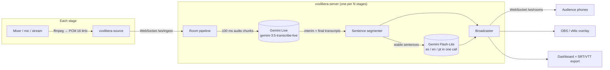

# Vox Libera

**Open source live captions and translation for multi-stage conferences.**
Plug in the audio of every stage and the audience gets real-time subtitles in the original
language plus Spanish, English and Portuguese, on their phone or burned into the stream.

Built for [Nerdearla](https://nerdear.la) 2026, designed so any conference can deploy it.
Powered by the Gemini Live API. Licensed under Apache 2.0.

| For the audience | For production |
|---|---|
| Pick a stage and a language, read live captions on any phone | One dashboard for every stage: status, latency, errors, cost |
| Download the full transcript (SRT / VTT / TXT) after the talk | OBS / vMix overlay URL, transparent background, no chroma key |
| Works for Spanish and English talks, with or without code-switching | Per-stage glossary for speaker names and tech jargon |

---

## Quick start (5 minutes)

You need **Python 3.11+**, **ffmpeg** in your PATH and a **Gemini API key** ([get one in AI Studio](https://aistudio.google.com/apikey)).

```bash
git clone https://github.com/Kitatzu/voxlibera.git
cd voxlibera
python -m venv .venv
# Windows: .venv\Scripts\activate    macOS/Linux: source .venv/bin/activate
pip install -e .

echo GEMINI_API_KEY=your-key > .env   # git-ignored; environment variables work too
voxlibera-server
```

> **Windows PowerShell:** create the file with `Set-Content .env "GEMINI_API_KEY=your-key" -Encoding ascii`
> (`echo >` writes UTF-16, which Docker Compose can't read).

Then open:

| URL | What |
|---|---|
| http://localhost:8000/dashboard.html | Production dashboard. Press **Simulate** on two stages to play the bundled sample talks. |
| http://localhost:8000/ | Audience view: choose stage + language. |
| http://localhost:8000/obs.html?room=main-stage&lang=es | Overlay for OBS (add as *Browser Source*). |

That's it: two stages transcribing and translating in parallel from the included samples.

### Or with Docker

```bash
echo GEMINI_API_KEY=your-key > .env
docker compose up --build        # PORT=8080 docker compose up to use another port
```

---

## Feeding real audio

Each stage (room) accepts **one audio source**. Rooms are defined in [`rooms.yaml`](rooms.yaml).

| Source | Command |
|---|---|
| Audio/video file (played at real-time speed) | `voxlibera-source --room main-stage --file samples/talk-en.opus` |
| Microphone / audio interface | `voxlibera-source --room main-stage --mic "Microphone (USB Audio)"` |
| Live stream (RTMP, SRT, HLS, Icecast...) | `voxlibera-source --room main-stage --url rtmp://mixer.local/live/stage1` |
| YouTube video or live stream | `voxlibera-source --room main-stage --youtube <url>` (add `--live` for live streams, needs `yt-dlp`) |
| List microphones | `voxlibera-source --list-devices` |

The source can run on the same machine as the server or on a laptop next to the stage mixer
(`--server wss://captions.example.org`). If the server sets `VOXLIBERA_ADMIN_KEY`, pass it with `--token`.

---

## How it works



### Design decisions (and the experiments behind them)

We measured the Live API with real Nerdearla talks before writing the pipeline.

| Finding | Decision |
|---|---|
| Interim transcripts arrive every ~0.5 s, < 1 s behind the speaker, with excellent accuracy on names (*Ilya Repin*, *100Devs*). | Streaming transcription instead of sending 3–5 s chunks: lower latency, no words cut at chunk borders. |
| Gemini only **finalizes** an utterance when the speaker pauses. Fluent speakers went **50+ s** without a final. | Translate each sentence as soon as it is complete and stable in the interim text (~1 s), don't wait for finals. Finals are used to correct already-shown sentences. |
| Tuning voice activity detection (`END_SENSITIVITY_HIGH`, 300 ms silence) cut utterances from ~50 s to 3–10 s. | Enabled, but the stable-sentence strategy still covers speakers who never pause. |
| A Live session lasts ~590 s. The server sends `GoAway` 50 s before the end and **aborts with 1008** if the client doesn't close. | Seamless rotation: on `GoAway` open a second session, feed audio to both, hand over at the old session's next final and strip the duplicated words. Talks of any length work. |
| `SMART` transcription mode turned sentences into Markdown bullet lists and dropped content. | `VERBATIM` transcription; filler words are removed by the translation prompt, which is told never to summarize. |
| One translation call returning every language, with glossary + previous sentence as context, fixed recognition errors ("your eyes" → "URIs"). | One Flash-Lite request per sentence for all languages. Adding a language costs no extra requests. |

---

## Scaling to many stages

**One server process handles many stages.** Everything is async and I/O-bound: the heavy lifting runs in Gemini.

| Limit | Value | Notes |
|---|---|---|
| Concurrent Live sessions per API key | 20 tested without errors | Rotation briefly uses 2 sessions per stage. |
| Transcription tokens per minute | 100K TPM (tier 1) | ~2K tokens/min per stream → **~25 stages per key**. |
| Translation requests per day | 150K RPD | ~8–10 sentences/min per stage → 10 stages × 8 h ≈ 48K requests. |
| Translation latency | ~1.5 s | Viewers see the translated sentence ~2.5 s after it is spoken. |

To go further:

1. **More stages than one key allows** → run several server instances, each with its own `VOXLIBERA_ROOMS_FILE` and API key (shard stages across instances).
2. **Many thousands of viewers** → run several replicas of the same instance behind a load balancer and swap the in-memory [`Broadcaster`](voxlibera/broadcaster.py) for Redis Pub/Sub (same three methods: `publish`, `subscribe`, `unsubscribe`).
3. **Audio sources** are independent processes, one per stage, anywhere on the network.

### Cost

Measured on a 12-minute talk: **US$ 0.16 → about US$ 0.80 per hour per stage**, with three target
languages (≈ US$ 0.55/h transcription at US$ 0.009/min, the rest translation). The dashboard shows a
live estimate per stage; prices are configurable in [`config.py`](voxlibera/config.py). Check the
current [Gemini pricing](https://ai.google.dev/gemini-api/docs/pricing).

### Measured on a real 12-minute talk

| Metric | Value |
|---|---|
| Session rotations (GoAway) / errors | 1 / 0, no lost or duplicated words at the handoff |
| Sentences | 159 |
| Translation latency | ~1 s |
| Translated caption delay after the sentence ends | ~0.6 s |

---

## Configuration

### `rooms.yaml`

```yaml
glossary: [Nerdearla, Kubernetes, deploy]      # shared by every stage

rooms:
  - id: main-stage                             # used in URLs
    name: Main Stage
    description: Keynotes and main track       # sent as context to the translator
    glossary: [Ilya Repin, Kuokkala]           # speaker names, talk-specific jargon
```

The glossary is used twice: as **custom vocabulary** for speech recognition (spelling of names) and
in the **translation prompt**, where terms are kept untranslated. Keep it under ~100 terms per stage.
Tip: update each stage's glossary with the next speaker's name and talk keywords.

### Environment variables

| Variable | Default | Description |
|---|---|---|
| `GEMINI_API_KEY` | — | **Required.** Gemini API key. |
| `VOXLIBERA_TARGET_LANGUAGES` | `es,en,pt` | Translation targets (BCP-47 codes). |
| `VOXLIBERA_TRANSCRIBE_MODEL` | `gemini-3.5-transcribe-live` | Live transcription model. |
| `VOXLIBERA_TRANSLATE_MODEL` | `gemini-3.5-flash-lite` | Translation model. |
| `VOXLIBERA_ROOMS_FILE` | `rooms.yaml` | Stages served by this instance. |
| `VOXLIBERA_ADMIN_KEY` | — | **Set it on any public deployment.** Required to broadcast audio and to use the dashboard actions (the pages ask for it once). The audience never needs it. |
| `VOXLIBERA_DATA_DIR` | `data/` | Where transcripts are persisted (JSONL per stage). |
| `VOXLIBERA_PORT` / `VOXLIBERA_HOST` | `8000` / `0.0.0.0` | Server bind address. |

---

## Outputs

| Output | How |
|---|---|
| Audience web app | `/` → shareable links like `/?room=main-stage&lang=es` (print them as QR codes at each stage). |
| OBS / vMix overlay | `/obs.html?room=main-stage&lang=en&lines=2&size=42&position=bottom`, transparent background. |
| Transcript files | `/api/rooms/<room>/export?format=srt\|vtt\|txt&lang=original\|es\|en\|pt`, or the buttons in the UI. Reset a stage between talks from the API: `POST /api/rooms/<room>/reset`. |
| Integrations | WebSocket + REST API documented in [`docs/PROTOCOL.md`](docs/PROTOCOL.md). |

---

## Development

```bash
pip install -e ".[dev]"
pytest
```

| Path | What |
|---|---|
| [`voxlibera/live_transcriber.py`](voxlibera/live_transcriber.py) | Gemini Live sessions, GoAway rotation, reconnection. |
| [`voxlibera/segmenter.py`](voxlibera/segmenter.py) | Interim transcripts → stable sentences + corrections. |
| [`voxlibera/translator.py`](voxlibera/translator.py) | One-call multi-language translation with glossary. |
| [`voxlibera/room.py`](voxlibera/room.py) | Per-stage pipeline, metrics, persistence. |
| [`voxlibera/server.py`](voxlibera/server.py) | FastAPI REST + WebSocket API, static frontend. |
| [`voxlibera/source.py`](voxlibera/source.py) | Audio source CLI (file, mic, stream, YouTube). |
| [`web/`](web/) | Audience view, OBS overlay, dashboard. Plain HTML/JS, no build step, works offline. |

## Known limitations

- Speaker diarization and word-level timestamps are not available in the Live API; subtitle timing is sentence-level.
- Live translation of a sentence can differ slightly from the final transcript; the corrected version replaces it on screen and in exports.
- A fully local mode (Gemma) is not implemented yet; the transcriber and translator are isolated modules to make that swap possible.

## License

[Apache License 2.0](LICENSE). Sample audio in [`samples/`](samples/) comes from public Nerdearla talks, see [`samples/README.md`](samples/README.md).
